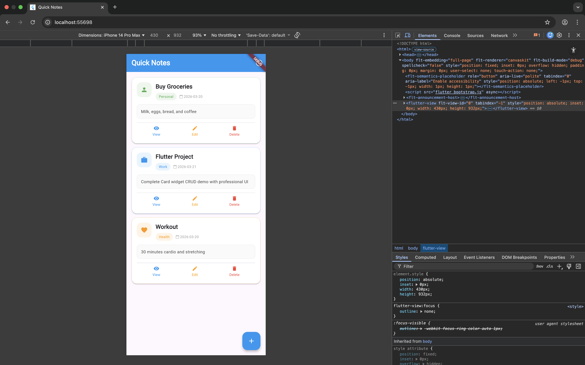

```markdown
# Flutter Card Widget - Quick Notes CRUD App

A professional notes application demonstrating Flutter's Card widget with complete CRUD operations (Create, Read, Update, Delete).

## 📱 App Overview
This app showcases the Card widget in a real-world notes management scenario. Users can add, view, edit, and delete notes, with each note displayed in a beautifully designed Card widget that demonstrates three key properties.

## 🚀 Quick Start
```bash
# Get dependencies
flutter pub get

# Run on Chrome (for web presentation)
flutter run -d chrome

# Or run on mobile device/emulator
flutter run
```

## 🎴 Card Widget Properties Demonstrated

### 1. elevation
- **Default value**: 2
- **Live change demonstration**: 0 → 2 → 8
- **Visual effect**: Controls shadow depth beneath the card (flat → subtle shadow → pronounced shadow)
- **Why developers use it**: Creates visual hierarchy in UI design - higher elevation makes important cards stand out from the background

### 2. shape
- **Default value**: RoundedRectangleBorder with borderRadius 16
- **Live change demonstration**: Square corners (0) → Rounded corners (16) → With colored border
- **Visual effect**: Controls corner rounding and adds borders to cards
- **Why developers use it**: Matches app design language and helps visually categorize different types of information

### 3. color
- **Default value**: Colors.white
- **Live change demonstration**: White → Light category color (blue/green/orange) → Alternative shade
- **Visual effect**: Changes the background color of the entire card
- **Why developers use it**: Color-codes different note categories (Work, Personal, Health) for quick visual recognition

## 📸 Screenshot


## 💾 CRUD Operations Implemented
- **CREATE**: Tap the + floating action button, fill the form, and save
- **READ**: Click the View button on any card to see full details
- **UPDATE**: Click the Edit button, modify the information, and save
- **DELETE**: Click the Delete button and confirm removal

## 📅 Presentation Date
March 20, 2026

## 🔧 Technical Details
- **Flutter version**: 3.x
- **Dart version**: 3.x
- **Main widget**: Card
- **State management**: setState (simple and effective for demo)

## 📁 Project Structure
```
lib/
  └── main.dart           # Complete application code
screenshot.png            # App screenshot for documentation
README.md                 # Project documentation
pubspec.yaml              # Project dependencies
```

## 📝 Notes
This application was built for a Flutter widget presentation focusing on the Card widget. The code demonstrates clean architecture with separate methods for each CRUD operation, making it easy to understand and present.

## ✅ Features
- Clean, professional UI with proper spacing
- Success notifications for all actions
- Empty state handling
- Category-based colors and icons
- Confirmation dialogs for destructive actions
- Responsive design that works on web and mobile

## 📚 Learning Outcomes
- Understanding Card widget properties
- Implementing full CRUD operations
- Professional Flutter UI design patterns
- State management with setState
- User feedback with SnackBar messages
```
